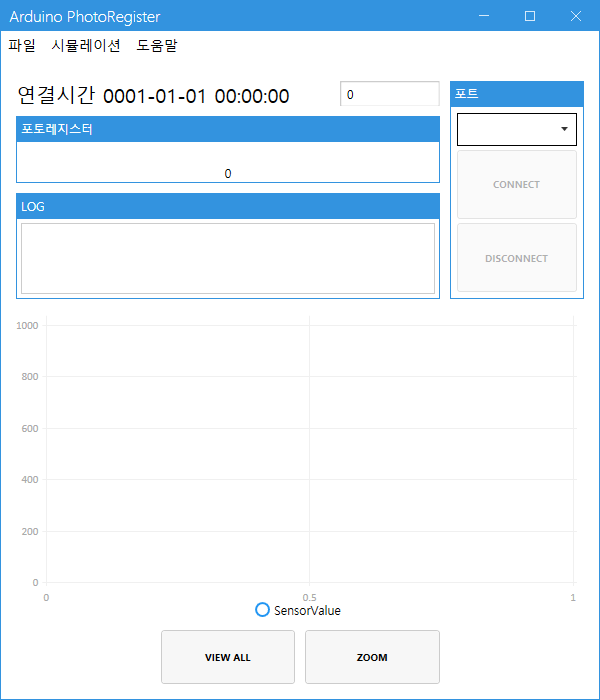
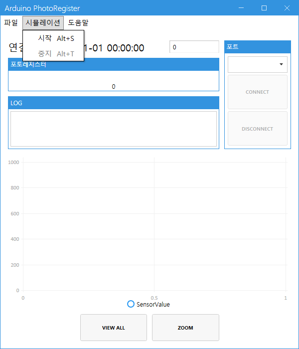
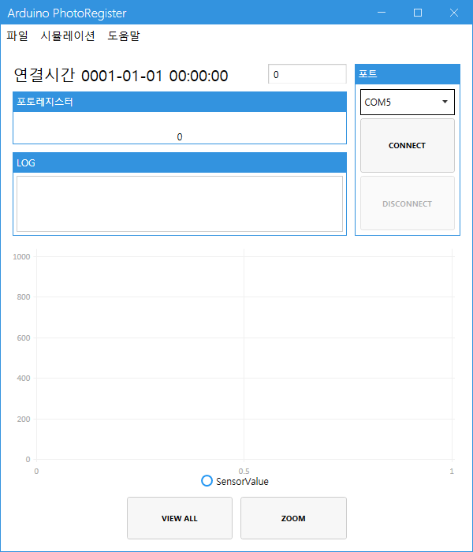
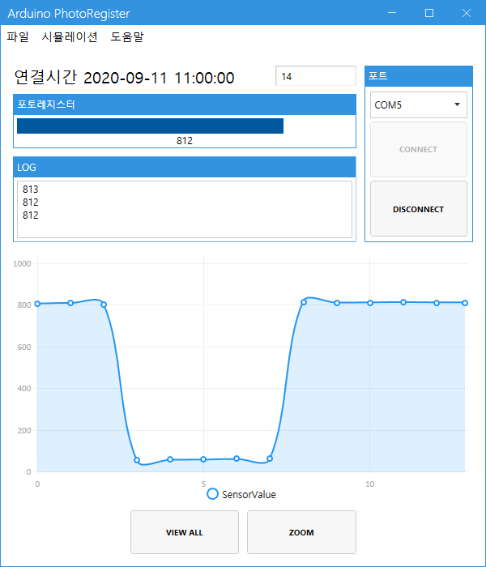
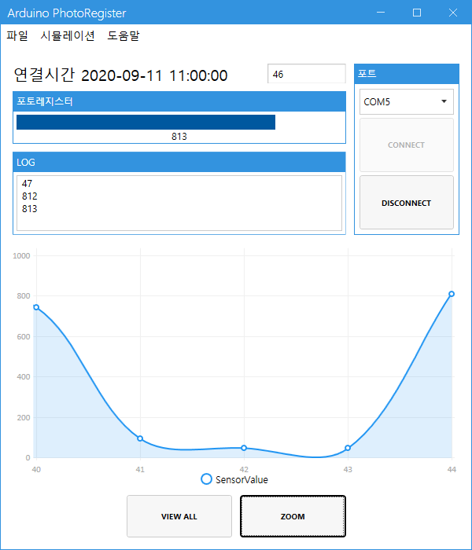
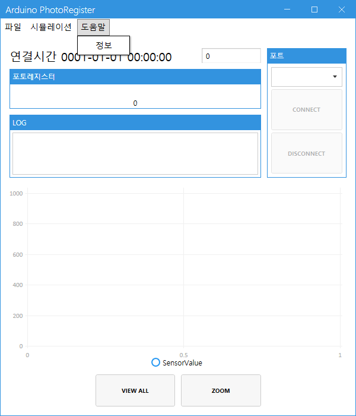
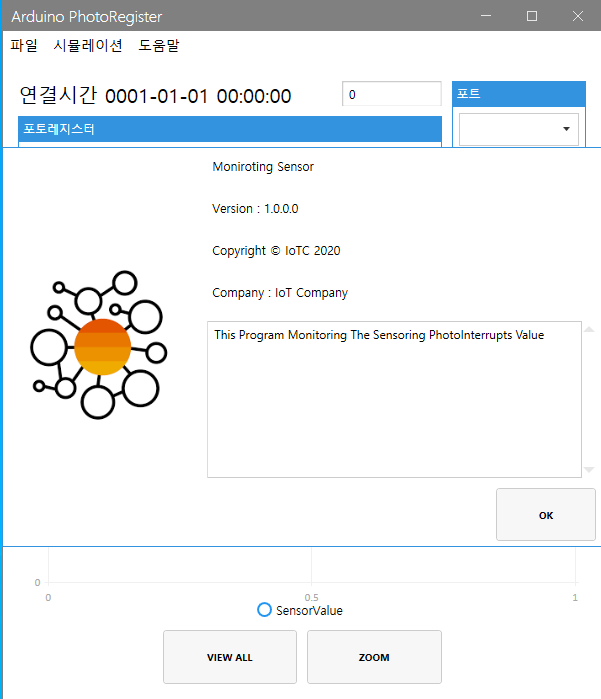

# WpfArduinoMonitoring
Arduino에서 SerailPort로 전송한 데이터를 LiveChart에 표시, Simulation 기능 제공

## 개요
- Arduino와 Serial통신을 통하여 받은 데이터를 차트로 표시한다.
- Arduino없이 기능을 확인할수있는 Simulation 기능을 제공한다.
- 최신데이터 5개를 보여주는 Zoom기능과 전체 데이터를 확인할수있는 ViewAll기능을 제공한다.
- 들어온 데이터와 에러를 기록하는 Log창을 제공한다.

### 사용 기술
- C# WPF Mvvm
- MahApps.Metro https://mahapps.com/
- SerialCommunication
- Async / Await 비동기 프로그래밍
- lock 키워드를 활용한 임계영역 관리

## 메인화면

## 시뮬레이션 메뉴

## 시리얼포트 확인

## 실행화면

## Zoom 기능

## 도움말 메뉴

## 정보창

